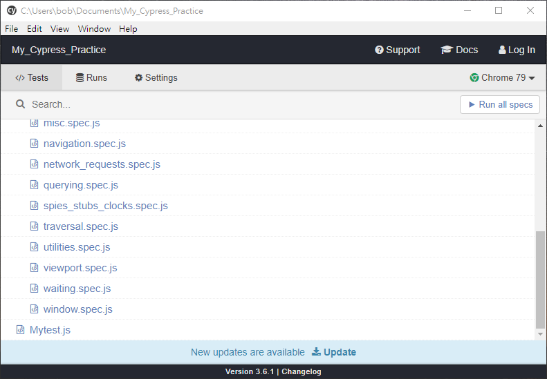

# My_Cypress_Practice
練習用Cypress執行web的e2e自動化測試

## Cypress環境架設
[注意] Cypress會吃Chrome的版本

### 1.安裝Node.js
Cypress 是用 Javascript 執行的，所以要先安裝 Node.js  
<a herf="https://nodejs.org/en/">Node.js 官網</a>

### 2.建立cypress目錄
先新建專案資料夾，開啟CMD，移動專案目錄下建立專案
```javascript
  cd [專案資料夾]
  npm install cypress --save-dev
```

### 3.啟動Cypress
確認目前是在專案目錄下，執行指令
```javascript
  .\node_modules\.bin\cypress open  --> windows
```

執行成功後應該可以看到以下視窗  
  

## 後記
參照：<a href="https://www.itread01.com/content/1543765093.html" target="_blank">e2e測試框架之Cypress</a>
